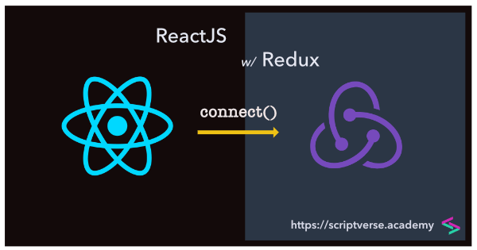

# An Introduction to Git and GitHub And a Bonus Feature on ***Redux***

## What is Git?
Simply put, Git is an extremely popular *version control system* used on wide variety of high-profile projects. Version control refers to the process of saving different files or ‘versions’ throughout the various stages of a project. This enables developers to keep track of what has been done and return to a previous phase if they decide they want to revert some of the changes they’ve made. Linus Torvalds created Git in 2005 for the development of the Linux kernel.

To understand Git, look at the following scenarios that developers faced before:

- Developers normally submitted their codes to the central server without having copies of their own
- Any changes made to the source code were unknown to the other developers
- There was no communication between any of the developers

That was **tough** because, how were conflicts resolved? 

After the introduction of Git in the developer's space:

- Every developer has an entire copy of the code on their local systems
- Any changes made to the source code can be tracked by others
- There is regular communication between the developers

Git is generally used for **source code management** in software development.

### Git Installation
Git is installed and maintained on your local system which gives you a self-contained record of your ongoing programming versions. It can be used completely *exclusive of any cloud-hosting service* — you don’t even need internet access, except to download it. That is so cool, right! 😎

Compared to other version control systems, Git is absolutely free, responsive and easy to use. Git is also specially designed to work well with text files — which, if you think about it, is what code actually is. For code, git specifically allows you to:
1. Track your history
2. Creates backups for code.
3. Collaborate with other developers

And my best, a feature that sets Git apart is...

4. **Branching.** 

Branching allows you to create independent local branches in your code. This means you can try out new ideas, set aside branches for production work, jump back to earlier branches, and easily delete, merge, and recall branches at the click of a button. You can do your work on a branch while the main branch (master) remains stable. After you are done with your work, you can merge it with the main office.

And that’s it. Git is a high-quality version control system.

## What is GitHub?
GitHub is designed as a Git repository hosting service. Basically, GitHub hosts Git repositories and provides developers with tools to ship better code through command line features, issues (threaded discussions), pull requests, code review, or the use of a collection of free and for-purchase apps in the GitHub Marketplace. You can think of it an *online database* that allows you to keep track of and share your Git version control projects outside of your local computer/server. Unlike Git, GitHub is exclusively cloud-based.

GitHub repositories are by default public thus, available. Developers from across the globe can interact with and contribute to each other’s code in order to modify or improve it, which is known as ***social coding***. In a way, this makes GitHub a networking site for web professionals. With collaboration layers like the GitHub flow, a community of 15 million developers, and an ecosystem with hundreds of integrations, GitHub changes the way software is built. 
 
GitHub builds collaboration directly into the development process. Work is organized into repositories where developers can outline requirements or direction and set expectations for team members. Then, using the GitHub flow, developers simply create a branch to *work on updates*, *commit changes* to save them, *open a pull request* to propose and discuss changes, and *merge pull requests* once everyone is on the same page.

There are three primary actions you can take when it comes to interacting with other developers’ code on GitHub:

- **Fork:** The process of copying another’s code from the repository in order to modify it.
- **Pull:** When you’ve finished making changes to someone else’s code, you can share them with the original owner via a ‘pull request’.
- **Merge:** Owners can add new changes to their projects via a merge, and give credit to the contributors who suggested them.

## Differences between Git and GitHub?
 | Git | Github|
| ----------- | ----------- |
| Git is a software| GitHub is a service |
| Git is a command-line tool | GitHub is hosted on the web |
| Git is maintained by linux | GitHub is maintained by Microsoft |
| Git is focused on version control and code sharing | GitHub is focused on centralized source code hosting |
| Git is a version control system to manage source code history | GitHub is a hosting service for Git repositories |
| Git has no user management feature | GitHub has a built-in user management feature |
| Git is open-source licensed | GitHub includes a free-tier and pay-for-use tier |
| Git has minimal external tool configuration | GitHub has an active marketplace for tool integration |
| Git provides a Desktop interface named Git Gui | GitHub provides a Desktop interface named GitHub Desktop |
| Git competes with CVS, Azure DevOps Server, Subversion, Mercurial, etc | GitHub competes with GitLab, Git Bucket, AWS Code Commit, etc |

## The Bonus Redux Experience - Redux Made Easy

Let's face it – state management across multiple components isn't easy. By definition, Redux is a “predictable state container for JavaScript apps.” To understand what the definition means, we need to understand each word.

1. **State.** In programming web and mobile apps, a state represents everything combined to keep an application running. 
2. **Predictable.** This attribute makes a state a state consistent, no matter the environment it is run in. 
2. A **container** is a fully-encapsulated app that includes everything necessary to run. 

Therefore, a **predictable state container** is a containerized app capable of remaining in a running, consistent state. Remember that with Redux, we’re talking about an application written in *JavaScript.*

Redux is a predictable state container designed to help you write JavaScript apps that **behave consistently** across client, server, and native environments and are easy to test. While it’s mostly used as a state management tool with React, you can use it with any other JavaScript framework or library. It’s lightweight at 2KB (including dependencies), so you don’t have to worry about it making your application’s asset size bigger. 

When working with Redux, you will need *three* main things:

- **Actions:** These are objects that should have two properties the *type* and the *payload*. The type property drives how the state should change and it's always required by Redux. The payload property instead describes what should change, and might be omitted if you don't have new data to save in the store. The second principle of Redux says the only way to change the state is by sending a signal to the store. This signal is an action. So "dispatching an action" means sending out a signal to the store.
- **Reducers:** These are functions that implement the behavior of the actions. They change the state of the app, based on the action description and the state change description. In a typical React component the local state might be mutated in place. In Redux you're not allowed to do that. The third principle of Redux (as outlined by its creator) prescribes that the state is immutable and cannot change in place. In other words the reducer must be pure. A pure function returns the exact same output for the given input. Despite this terminology reasoning about a reducer is not that hard.
- **Store:** it brings the actions and reducers together, holding and changing the state for the whole app — there is only one store.

With Redux, the state of your application is kept in a store, and each component can access any state that it needs from this store. State management is a way to facilitate communication and sharing of data across components. It creates a tangible data structure to represent the state of your app that you can read from and write to. That way, you can see otherwise invisible states while you’re working with them. State management gets messy as the app gets complex. This is why you need a state management tool like Redux that makes it easier to maintain these states. When using Redux with React, states will no longer need to be lifted up. This makes it easier for you to trace which action causes any change. 
